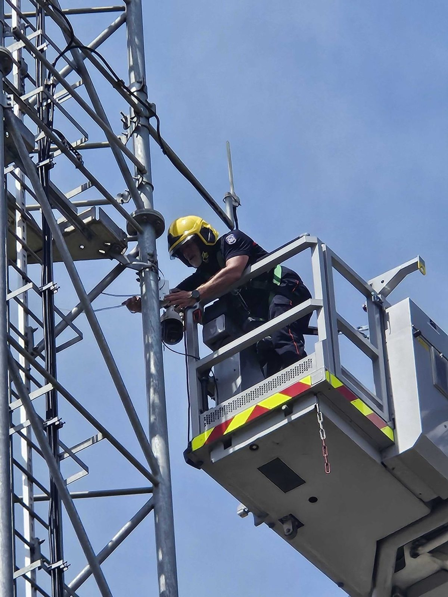
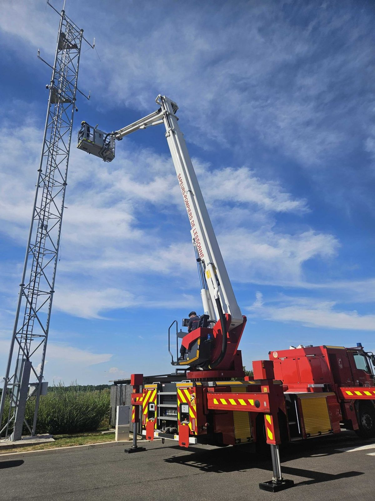
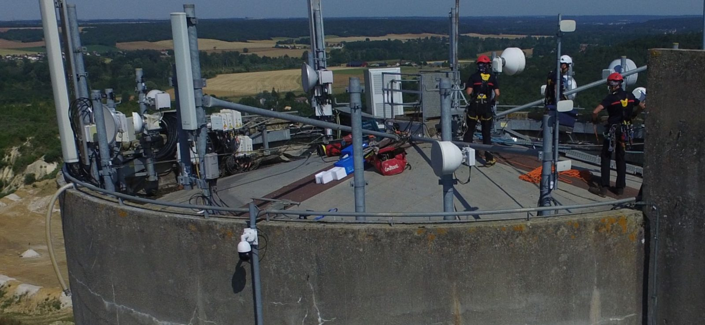

Desde 2021, Pyronear despliega sus estaciones con los servicios de bomberos y socios privados. Cada despliegue se construye con los equipos locales: identificación de puntos altos, estudio de cobertura, instalación de las estaciones, formación de los operadores y balance después de cada temporada de incendios.

## Instalación {#installation}

Nuestras estaciones están pensadas para ser **plug and play**: sencillas, robustas y rápidas de instalar. Una instalación lleva **menos de media jornada por estación**. Puede hacerla un profesional acreditado o directamente el servicio de bomberos.

**Ejemplo en Essonne**: el 19 de junio de 2026, el servicio de bomberos de Essonne (SDIS 91) instaló por sí mismo 2 nuevas estaciones en un día, en plena ola de calor. Gracias a la Communauté de Communes des 2 Vallées por su ayuda para identificar y acceder a los puntos altos, y a Crédit Agricole d'Île-de-France, que financia estaciones para los servicios de bomberos.




