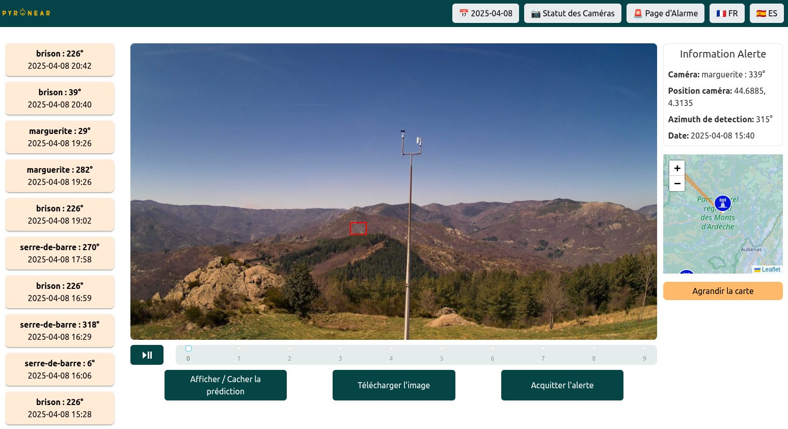

## A complete solution

Pyronear is a **complete fire risk management solution**. It consists of an **early wildfire detection algorithm**, implemented on a microcomputer, connected to **cameras positioned on high spots** with a view on the forest. Our detectors communicate **fire alerts** to a database that is connected to a **supervision platform** for the fire department.



*Demonstration of the Pyronear system in the Fontainebleau forest, from detection to alert.*

## The detection station

Our stations are installed on high points (pylons, water towers, lookout towers) overlooking the forest. High-resolution cameras cover the horizon at 360°, and a credit-card-sized micro-computer analyses the images on site with our artificial intelligence model. Very energy-efficient, a station can run on a solar panel and communicates over 4G.

- Smoke detection up to **15 km** away
- Up to **2 hours earlier** than the first emergency calls
- On-site analysis, **very low power use**, standard hardware
- Record: a fire start detected **42 km** away

Our detection towers consist of 4/5 high resolution cameras and a micro computer. We capture one image per camera at regular intervals and then analyze it locally using our wildfire detection model. In case of detection, the alert mode is activated, all the images coming from the camera having detected the fire are then sent to our database via our api, the communication protocol we have developed.





## Fewer false alarms

Early smoke can look like a cloud, fog or dust. To avoid alerting firefighters for nothing, every detection goes through two steps:

1. **Spot**: on each image, our model flags anything that looks like smoke.
2. **Confirm**: the system follows this smoke over several images. Real smoke stays in the same place, grows and slowly drifts, unlike a cloud.

The result: **4 times fewer false alarms**, without missing real fires.

## The alert platform

When a station detects smoke, the images are sent to our web platform. Fire service operators receive the alert in real time: they confirm it, control the cameras and locate the fire by triangulation between several stations.

In April 2026, a station spotted the first fire of the year in the Fontainebleau forest, twenty minutes before the first emergency call.





## Try the model

Test our detection model in your browser: pick a camera image and watch it spot the smoke.



## Open source

All our work is released under a free licence (Apache 2.0): the station software, the AI models and the platform. Any fire service, local authority or researcher can reuse it without depending on a vendor. Find our code on [GitHub](https://github.com/pyronear).

## Why an open data set?

Our detection algorithm is an **artificial intelligence (AI)** model that has been trained on numerous **images of fire outbreaks**. In other words, the algorithm has been trained to recognise smoke and flames in numerous situations and in different areas.

To this end, **with the help of our partners and volunteers**, we are building a **dataset** that we are sharing in **open data**, so that the images collected and annotated can be used by as many people as possible. In this way, by sharing these resources, we are increasing the chances of preserving another resource: forests and natural areas.

- [Find the dataset on HuggingFace](https://huggingface.co/datasets/pyronear/pyro-sdis)
- [Legal note for fire services who want to share their images (in French)](https://pyronear.notion.site/Notes-de-synth-se-FAQ-du-webinaire-open-data-DINUM-SDIS-MSP-18c425b63668806cb5dbc7a35d7452b4)

## Going further

Our partner [EarthToolsMaker](https://www.earthtoolsmaker.org/) explains in detail how we improved our models:

- [Smoke Is a Behavior: Inside Pyronear's Temporal Wildfire Detection Model](https://www.earthtoolsmaker.org/posts/smoke-is-a-behavior/)
- [Racing Models, Not Opinions: How We Ran Wildfire ML R&D for Pyronear](https://www.earthtoolsmaker.org/posts/racing-models-not-opinions/)
- [Protecting the Forest: Building an early forest fire detector](https://www.earthtoolsmaker.org/posts/protecting-the-forest-early-forest-fire-detector/)
