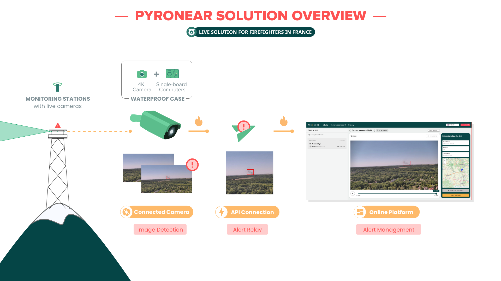

## Una solució completa

Pyronear és un **solució completa de gestió del risc d'incendi**. Consta d'un **algorisme de detecció precoç d'incendis forestals**, implementat en un microordinador, connectat a **càmeres col·locades en punts alts** amb vistes al bosc. Els nostres detectors es comuniquen **alertes d'incendi** a una base de dades connectada a **plataforma de supervisió** per al cos de bombers.



*Un minidocumental sobre Pyronear, realitzat per Fast Forward.*

## L'estació de detecció

Les nostres estacions s'instal·len en punts alts (torres elèctriques, dipòsits d'aigua, torres de guaita) amb vista al bosc. Càmeres d'alta resolució cobreixen l'horitzó a 360° i un microordinador de la mida d'una targeta de crèdit analitza les imatges in situ amb el nostre model d'intel·ligència artificial. Molt sòbria en energia, l'estació pot funcionar amb un panell solar i es comunica per 4G.

- Detecció de fum fins a **15 km**
- Fins a **2 hores d'avançament** sobre les primeres trucades d'emergència
- Anàlisi in situ, **consum molt baix**, maquinari estàndard
- Rècord: un inici d'incendi detectat a **42 km**

Una estació s'instal·la en menys de mitja jornada: [vegeu com]().

Les nostres torres de detecció estan formades per 4/5 càmeres d'alta resolució i un micro ordinador. Capturem una imatge per càmera a intervals regulars i després l'analitzem localment mitjançant el nostre model de detecció d'incendis forestals. En cas de detecció, s'activa el mode d'alerta, totes les imatges procedents de la càmera després d'haver detectat l'incendi s'envien a la nostra base de dades a través de la nostra API, el protocol de comunicació que hem desenvolupat.





## Menys falses alarmes

Un fum incipient pot semblar un núvol, boira o pols. Per no alertar els bombers en va, cada detecció passa per dues etapes:

1. **Detectar**: a cada imatge, el nostre model assenyala tot el que sembla fum.
2. **Confirmar**: el sistema segueix aquest fum en diverses imatges. Un fum real es queda al mateix lloc, creix i es desplaça lentament, a diferència d'un núvol.

Resultat: **4 vegades menys falses alarmes**, sense perdre els incendis reals.

## La plataforma d'alertes

Quan una estació detecta fum, les imatges s'envien a la nostra plataforma web. Els operadors dels serveis de bombers reben l'alerta en temps real: la confirmen, controlen les càmeres i localitzen l'incendi per triangulació entre diverses estacions.

L'abril del 2026, una estació va detectar el primer incendi de l'any al bosc de Fontainebleau, vint minuts abans de la primera trucada d'emergència.

El que permet la plataforma:

- **Alertes en directe**: les alertes del dia, amb les seves seqüències d'imatges per reproduir i ampliar.
- **Localització de l'incendi**: quan diverses càmeres veuen el mateix fum, la seva posició apareix al mapa.
- **Verificació remota**: prendre el control d'una càmera a distància (orientació, zoom, clic per centrar) per confirmar o descartar una alerta.
- **Etiquetatge**: classificar cada alerta com a inici d'incendi, fum no rellevant o un altre fals positiu.
- **Màscares**: ignorar un fum recurrent, com la xemeneia d'una fàbrica.
- **Seguiment de les càmeres**: l'estat i l'última imatge de cada càmera, amb un avís si una es desconnecta.
- **Compartir i historial**: enviar una alerta a un company, trobar alertes passades i exportar-les en CSV.





## Prova el model

Prova el nostre model de detecció al navegador: tria una imatge de càmera i mira com detecta el fum.



## Open source

Tota la nostra feina es publica amb llicència lliure (Apache 2.0): el programari de les estacions, els models d'IA i la plataforma. Qualsevol servei de bombers, administració local o investigador la pot reutilitzar sense dependre d'un proveïdor. Trobeu el nostre codi a [GitHub](https://github.com/pyronear).

## Per què un conjunt de dades obertes?

El nostre algorisme de detecció és un **model d'intel·ligència artificial (IA)** entrenat en nombroses **imatges d'inici de foc**. És a dir, l'algorisme ha estat entrenat per reconèixer el fum i les flames. en moltes situacions i en diferents territoris.

Amb aquesta finalitat, estem construint **amb l'ajuda dels nostres socis i voluntaris**, un **conjunt de dades** que compartim en **dades obertes**, en per tal que les imatges recollides i anotades puguin ser utilitzades per tantes persones com sigui possible. Així, posant en comú aquests recursos, augmentem les possibilitats de preservar un altre recurs, boscos i espais naturals

- [Trobeu el conjunt de dades a HuggingFace](https://huggingface.co/datasets/pyronear/pyro-sdis)
- [Nota jurídica per als serveis de bombers que vulguin compartir les seves imatges (en francès)](https://pyronear.notion.site/Notes-de-synth-se-FAQ-du-webinaire-open-data-DINUM-SDIS-MSP-18c425b63668806cb5dbc7a35d7452b4)

## Per saber-ne més

El nostre soci [EarthToolsMaker](https://www.earthtoolsmaker.org/) explica en detall com hem millorat els nostres models (en anglès):

- [Smoke Is a Behavior: Inside Pyronear's Temporal Wildfire Detection Model](https://www.earthtoolsmaker.org/posts/smoke-is-a-behavior/)
- [Racing Models, Not Opinions: How We Ran Wildfire ML R&D for Pyronear](https://www.earthtoolsmaker.org/posts/racing-models-not-opinions/)
- [Protecting the Forest: Building an early forest fire detector](https://www.earthtoolsmaker.org/posts/protecting-the-forest-early-forest-fire-detector/)
