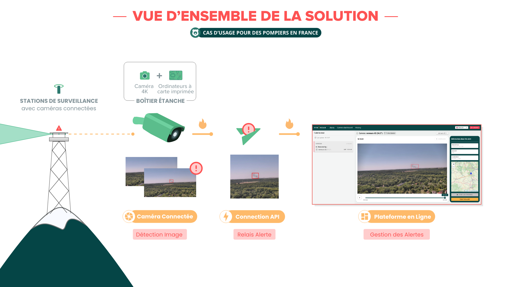
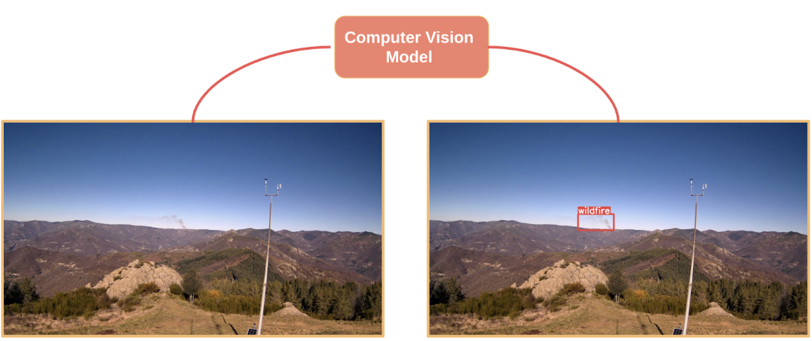
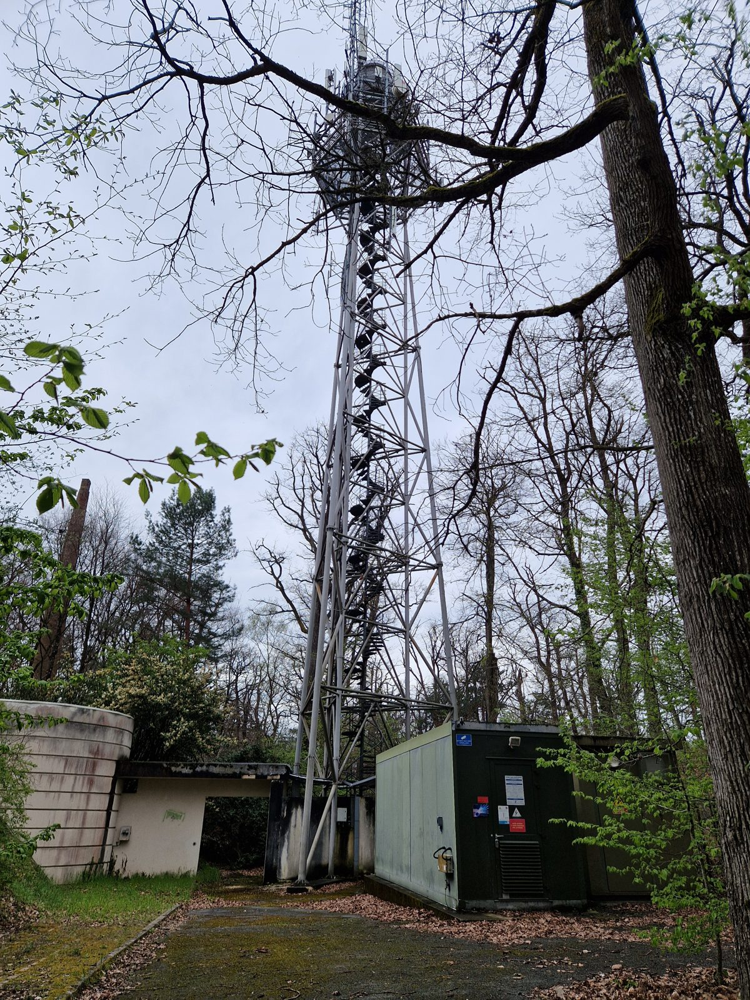
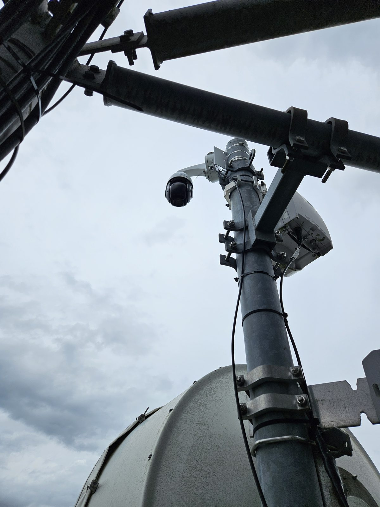
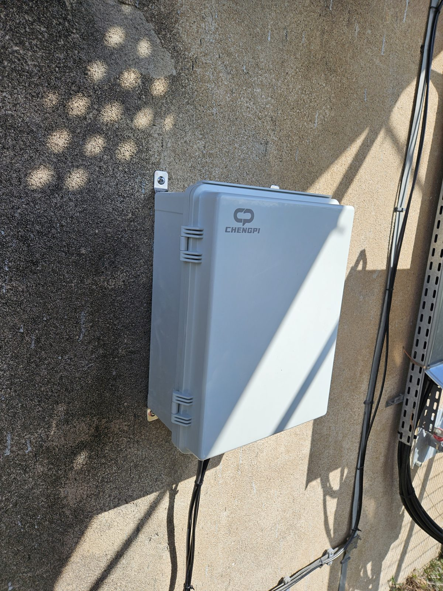
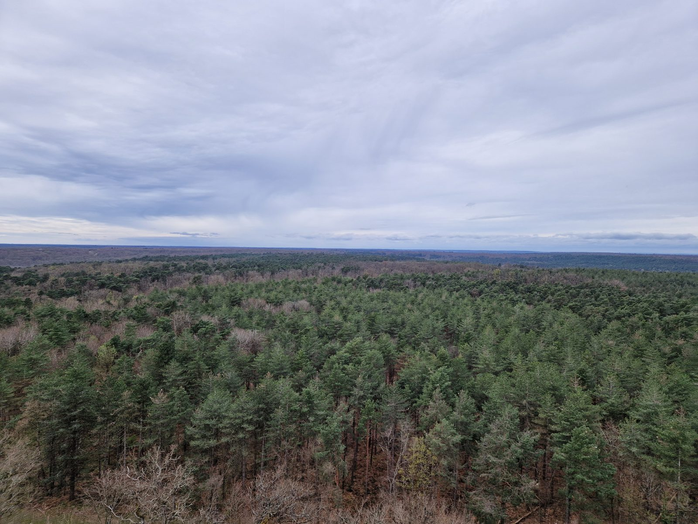
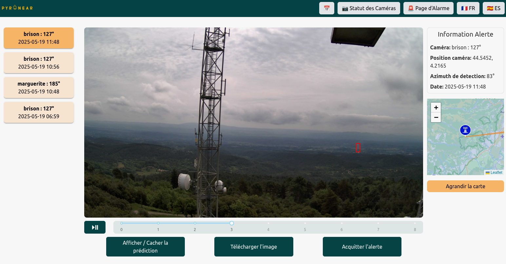
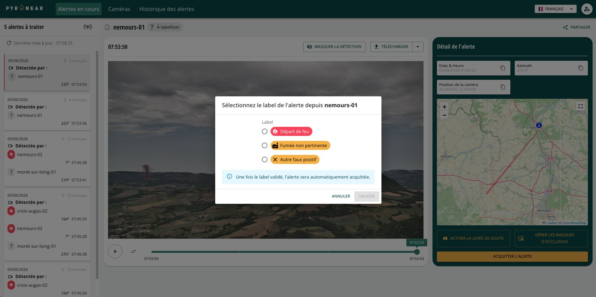
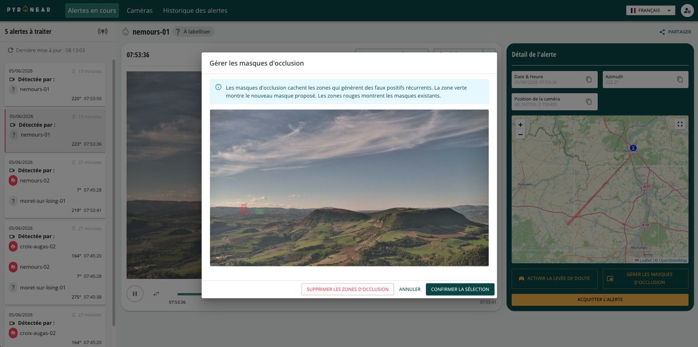
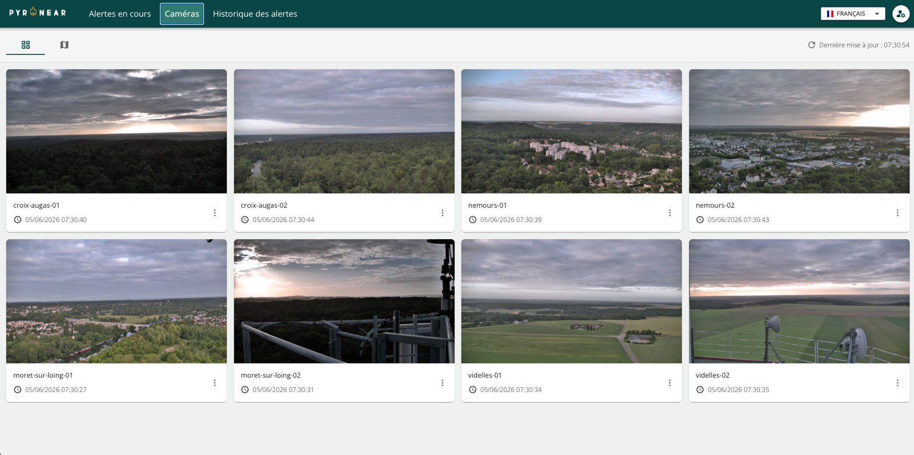

## Une solution complète

Pyronear est une **solution complète de gestion du risque incendie**. Elle est constituée d’un **algorithme de détection** précoce des départs de feu, implémenté sur un micro ordinateur, connecté à des **caméras positionnées sur des points hauts** avec vue sur la forêt. Nos détecteurs communiquent les **alertes de détection de départ de feu** à une base de données elle-même connectée à une **plateforme de supervision** à destination des pompiers.



*Mini-documentaire sur Pyronear, réalisé par Fast Forward.*

## La station de détection

Nos stations sont installées sur des points hauts (pylônes, châteaux d'eau, tours de guet) avec vue sur la forêt. Des caméras haute résolution couvrent l'horizon à 360° et un micro-ordinateur, de la taille d'une carte de crédit, analyse les images sur place avec notre modèle d'intelligence artificielle. Très sobre en énergie, la station peut fonctionner sur panneau solaire et communique en 4G.

- Détection des fumées jusqu'à **15 km**
- Jusqu'à **2 heures d'avance** sur les premiers appels au 18
- Analyse sur place, **très faible consommation**, matériel standard
- Record : un départ de feu détecté à **42 km**

Une station s'installe en moins d'une demi-journée : [voir comment]().

Nos tours de détection se composent de 4/5 caméras haute résolution et d’un micro ordinateur qui capture une image par caméra à intervalles réguliers puis l’analyse localement à l’aide de notre modèle de détection de feux de forêt. En cas de détection, le mode alerte est activé, toutes les images provenant de la caméra ayant détecté le feu sont alors envoyées à notre base de données via notre api, le protocole de communication que nous avons développé.





## Moins de fausses alertes

Une fumée naissante ressemble parfois à un nuage, à du brouillard ou à de la poussière. Pour ne pas alerter les pompiers pour rien, chaque détection passe par deux étapes :

1. **Repérer** : sur chaque image, notre modèle signale tout ce qui ressemble à une fumée.
2. **Confirmer** : le système suit cette fumée sur plusieurs images. Une vraie fumée reste au même endroit, grossit et dérive lentement, contrairement à un nuage.

Résultat : **4 fois moins de fausses alertes**, sans manquer les vrais départs de feu.

## La plateforme d'alerte

Quand une station détecte une fumée, les images sont envoyées à notre plateforme web. Les opérateurs des SDIS y reçoivent l'alerte en temps réel : ils lèvent le doute, pilotent les caméras et localisent le départ de feu par triangulation entre plusieurs stations.

En avril 2026, une station a ainsi repéré le premier feu de l'année en forêt de Fontainebleau, vingt minutes avant le premier appel au 18.

Ce que permet la plateforme :

- **Alertes en direct** : les alertes du jour, avec leurs séquences d'images à faire défiler et à zoomer.
- **Localisation du feu** : quand plusieurs caméras voient la même fumée, sa position s'affiche sur la carte.
- **Levée de doute** : prendre la main sur une caméra à distance (orientation, zoom, clic pour centrer) pour confirmer ou écarter une alerte.
- **Annotation** : classer chaque alerte en départ de feu, fumée non pertinente ou autre faux positif.
- **Masques** : ignorer une fumée récurrente, comme une cheminée d'usine.
- **Suivi des caméras** : l'état et la dernière image de chaque caméra, avec un signal en cas de coupure.
- **Partage et historique** : envoyer une alerte à un collègue, retrouver les alertes passées et les exporter en CSV.





## Essayer le modèle

Testez notre modèle de détection dans votre navigateur : choisissez une image de caméra et regardez-le repérer les fumées.



## Open source

Tout notre travail est publié sous licence libre (Apache 2.0) : le logiciel des stations, les modèles d'IA et la plateforme. Tout service d'incendie, collectivité ou chercheur peut le réutiliser, sans dépendre d'un fournisseur. Retrouvez notre code sur [GitHub](https://github.com/pyronear).

## Pourquoi un dataset open data ?

Notre algorithme de détection est un **modèle d’intelligence artificielle (IA)** entrainé sur de nombreuses **images de départ de feux**. C’est à dire que l’algorithme a été entrainé à reconnaître des fumées et flammes dans de nombreuses situations et sur différents territoires.

A cette fin, nous construisons **à l’aide de nos partenaires et bénévoles**, un **dataset** que nous partageons en **open data**, afin que les images collectées et annotées puissent servir au plus grande nombre. Ainsi, en mettant en commun ces ressources, nous augmentons les chances de préserver une autre ressource, les forêts et espaces naturels.

- [Retrouvez le dataset sur HuggingFace](https://huggingface.co/datasets/pyronear/pyro-sdis)
- [Note juridique pour les SDIS qui souhaitent partager leurs images](https://pyronear.notion.site/Notes-de-synth-se-FAQ-du-webinaire-open-data-DINUM-SDIS-MSP-18c425b63668806cb5dbc7a35d7452b4)

## Pour aller plus loin

Notre partenaire [EarthToolsMaker](https://www.earthtoolsmaker.org/) raconte en détail comment nous avons amélioré nos modèles (en anglais) :

- [Smoke Is a Behavior: Inside Pyronear's Temporal Wildfire Detection Model](https://www.earthtoolsmaker.org/posts/smoke-is-a-behavior/)
- [Racing Models, Not Opinions: How We Ran Wildfire ML R&D for Pyronear](https://www.earthtoolsmaker.org/posts/racing-models-not-opinions/)
- [Protecting the Forest: Building an early forest fire detector](https://www.earthtoolsmaker.org/posts/protecting-the-forest-early-forest-fire-detector/)
